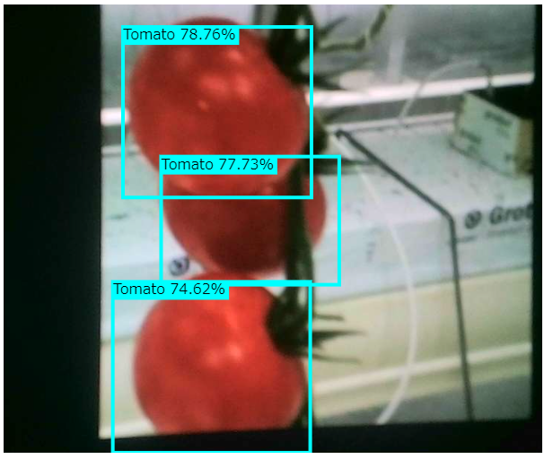

This is a repository tested [this Tensorflow.js object detection](
https://blog.tensorflow.org/2021/01/custom-object-detection-in-browser.html) on my PC. I tested two datasets.

- [Kangaroo](https://www.kaggle.com/datasets/hugozanini1/kangaroodataset)
- [Tomato](https://www.kaggle.com/datasets/andrewmvd/tomato-detection)



# Environment
OS: Windows 11 Pro
OS version: 21H2
OS Build: 22000.556
Processor: Intel(R) Core(TM) i9-9900K CPU @ 3.60GHz
RAM size: 32GB
Graphics: NVIDIA GeForce RTX 2080
Anaconda: Installed with Anaconda3-2021.11-Windows-x86_64.exe
Python: 3.9.12 (As of 2022-04-09 Tensorflow does not support Python 3.10)

# Training time
On my PC, it took about 2 hours to train the model for kangaroos and 1 hour for tomatos. I've got the following log in every 100 steps. The time took to run a step is about 1 sec and the total steps were 7500.
```
INFO:tensorflow:Step 700 per-step time 1.045s
I0408 17:25:05.043267 22092 model_lib_v2.py:705] Step 700 per-step time 1.045s
INFO:tensorflow:{'Loss/classification_loss': 0.6570982,
 'Loss/localization_loss': 0.4827449,
 'Loss/regularization_loss': 0.6568394,
 'Loss/total_loss': 1.7966825,
 'learning_rate': 0.36666453}
I0408 17:25:05.044265 22092 model_lib_v2.py:708] {'Loss/classification_loss': 0.6570982,
 'Loss/localization_loss': 0.4827449,
 'Loss/regularization_loss': 0.6568394,
 'Loss/total_loss': 1.7966825,
 'learning_rate': 0.36666453}
```

# Tomato dataset needs to be processed
Tomato dataset has annotation XML files but it does not contian CSV files as kangaroo dataset. `dtaset_processor` folder contains a script to process the annotation XML files and generates CSVs.

# Trained models
I left the trained models in this repo. `inference_graph_*` contains raw exported Tensorflow saved models. `tfjs_model_*` contains the converted tfjs models. `k` and `t` are the trained models for kangaroos and tomatos. The number means the steps trained.

# Precedure Notes

## Failed to install Kaggle cli
Installing kaggle-cli did not work. I skipped the following step.
```
pip install -q kaggle-cli
```

I downloaded datasets from [a Kaggle's page](https://www.kaggle.com/datasets/hugozanini1/kangaroodataset).

## Training batch size
In the step to build mobilenet_v2.config, I set a smaller number than the original because my PC emitted OOM (out of memory) error and failed to train at my first training. This depends on the GPU memory size and the dataset. I used 64 for kangaroo and 32 for tomatos.

```
train_config: {
  fine_tune_checkpoint_version: V2
  fine_tune_checkpoint: "mobilenet_v2/mobilenet_v2.ckpt-1"
  fine_tune_checkpoint_type: "classification"
  batch_size: 64
  sync_replicas: true
  startup_delay_steps: 0
  replicas_to_aggregate: 8
  num_steps: 7500
  data_augmentation_options {
    random_horizontal_flip {
    }
  }
  data_augmentation_options {
    ssd_random_crop {
    }
  }
  optimizer {
    momentum_optimizer: {
      learning_rate: {
        cosine_decay_learning_rate {
          learning_rate_base: .8
          total_steps: 50000
          warmup_learning_rate: 0.13333
          warmup_steps: 2000
        }
      }
      momentum_optimizer_value: 0.9
    }
    use_moving_average: false
  }
  max_number_of_boxes: 100
  unpad_groundtruth_tensors: false
}
```

## The command for Colab does not work on terminal (Anaconda Prompt).
The bash commands does not work on terminal because they uses Colab's variables and the pathes. I changed a little bit like the below.

```
python dataset/generate_tf_records.py -l labelmap.pbtxt -o dataset/train.record -i dataset/images -csv dataset/train_labels.csv
python dataset/generate_tf_records.py -l labelmap.pbtxt -o dataset/test.record -i dataset/images -csv dataset/test_labels.csv

python models/research/object_detection/model_main_tf2.py --pipeline_config_path=mobilenet_v2.config --model_dir=training/ --alsologtostderr --num_train_steps=7500 --sample_1_of_n_eval_examples=1 --num_eval_steps=1000

python models/research/object_detection/model_main_tf2.py --pipeline_config_path=mobilenet_v2.config --model_dir=training/ --checkpoint_dir=training

python models/research/object_detection/exporter_main_v2.py --trained_checkpoint_dir=training/ --output_directory=inference_graph/ --pipeline_config_path mobilenet_v2.config
```

## Tensorflow.js prediction result format is different from the original.
In the [source code on GIthub](https://github.com/hugozanini/TFJS-object-detection/blob/master/src/index.js#L118), he uses 4, 5 and 6 as indexes to retrive the result of boxes, scores and classes. However, that was different from each trained model. We have to find our indexes.

```
const boxes = predictions[4].arraySync();
const scores = predictions[5].arraySync();
const classes = predictions[6].dataSync();
```

The tensor shapes and the data type tells us which is which.
- scores: [1, 100] / float
- boxes: [1, 100, 4] / float
- classes: [1, 100] / int (Always 1)

## tensorflowjs_converter command example
Instead of the wizard, we can use the following command to convert the model to Tensorflow.js format.
```
tensorflowjs_converter --input_format=tf_saved_model --output_format=tfjs_graph_model inference_graph/saved_model/ tfjs_model
```
